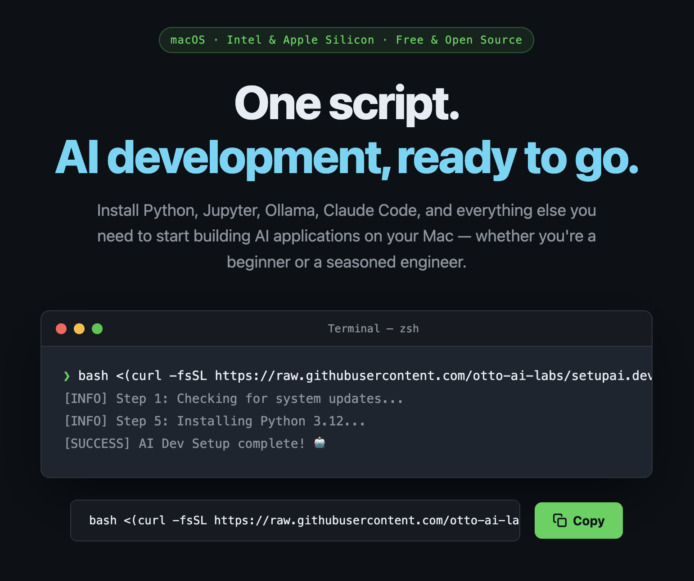

# AI Dev Setup

> **One script. AI development, ready to go.**

[](https://www.apple.com/macos/)
[](https://opensource.org/licenses/MIT)
[](https://www.gnu.org/software/bash/)



Set up your Mac for AI development in a single command. Installs Python, Jupyter, Ollama, Claude Code, Codex CLI, and everything else you need to start building AI applications — whether you're a total beginner or an experienced engineer.

Works on both **Intel** and **Apple Silicon** Macs (M1, M2, M3, M4 and later).

**Website:** [setupai.dev](https://setupai.dev)

---

## Table of Contents

- [Before You Start](#before-you-start)
- [Quick Start](#quick-start)
- [What Gets Installed](#what-gets-installed)
- [macOS System Changes](#macos-system-changes)
- [Installation Options](#installation-options)
- [After the Script Finishes](#after-the-script-finishes)
- [Troubleshooting](#troubleshooting)
- [Security & Privacy](#security--privacy)
- [Performance Tips](#performance-tips)
- [Contributing](#contributing)

---

## Before You Start

Take 5 minutes to do these things first — they'll save you time later.

**1. Update macOS**
Go to **System Settings → General → Software Update** and install any pending updates.

**2. Have your Git details ready**
The script will ask for your name and email address to configure Git. Use the same name and email as your GitHub account.

**3. Decide which tools you want**
The script shows a checkbox menu for each category (AI tools, databases, editors, apps). You pick what to install. If you're not sure, just press **Enter** to accept the recommended defaults.

**4. Make sure you have a stable internet connection**
The script downloads several gigabytes of tools. A wired or strong Wi-Fi connection is recommended.

**5. Set aside 30–60 minutes**
You can walk away during most of the installation. Just stay nearby in case a popup asks for your password.

---

## Quick Start

Open the **Terminal** app (press **Cmd + Space**, type **Terminal**, press Enter) and paste one of the following commands.

> **New:** The script now shows an interactive menu before installing. Use **↑/↓** to move, **Space** to toggle, **A** to select all, **N** to deselect all, and **Enter** to confirm each category.

### Option A — Run directly (fastest)

```bash
bash <(curl -fsSL https://raw.githubusercontent.com/otto-ai-labs/setupai.dev/main/setup.sh)
```

### Option B — Download first, then run (recommended if you want to review the scripts)

```bash
# Step 1: Download the repository
git clone https://github.com/otto-ai-labs/setupai.dev.git

# Step 2: Move into the folder
cd setupai.dev

# Step 3: Run it
./setup.sh
```

> **What is Terminal?** Terminal is an app on your Mac that lets you type commands directly to your computer. Think of it as a text-based way to control your Mac — very powerful for developers.

---

## Individual Scripts

Each script can also be run on its own — you don't need to run the full `setup.sh`.

| Script | What it does |
|--------|-------------|
| `setup.sh` | Full AI dev setup — runs all modules in order |
| `bootstrap.sh` | Syncs dotfiles from this repo to your home directory (`~`) |
| `brew.sh` | Installs Xcode CLI tools, Homebrew, and all core packages |
| `osx.sh` | Applies macOS system defaults tuned for developers |
| `web.sh` | Sets up JavaScript/web development tools |

```bash
# Install Homebrew + packages only
./brew.sh

# Apply macOS developer defaults only
./osx.sh

# Set up JS/web dev tools only
./web.sh

# Sync dotfiles to ~
./bootstrap.sh
```

---

## What Gets Installed

Here is every tool the script installs. Nothing is hidden.

---

### Essential Tools
*Installed always. The foundation everything else builds on.*

| Tool | What it does |
|------|-------------|
| **Homebrew** | The package manager for macOS. Used to install almost everything else. |
| **Git** | Version control — tracks changes to your code and enables collaboration. |
| **SSH Key** | A secure login key auto-generated and tied to your Git email. Add it to GitHub once. |
| **Starship** | A fast, smart terminal prompt that shows your Git branch, Python env, and more. |
| **Oh My Zsh** | Shell framework with plugins and themes for zsh. |
| **zsh-autosuggestions** | Suggests commands as you type, based on your history. |
| **zsh-syntax-highlighting** | Highlights valid commands in green and errors in red as you type. |
| **bat** | Like `cat` but with syntax highlighting and line numbers. |
| **eza** | A modern `ls` with colours, icons, and Git status. |
| **fd** | A faster, friendlier alternative to `find`. |
| **ripgrep** | An extremely fast alternative to `grep`. |
| **fzf** | A fuzzy command-line finder — search files, history, and more interactively. |
| **jq** | Parse and query JSON from the command line. |
| **yq** | Parse and query YAML from the command line. |
| **htop** | An interactive process viewer (better than `top`). |
| **tree** | Display directory structure as a tree. |
| **wget / curl** | Download files from the internet via the terminal. |

---

### Programming Languages
*The languages your AI code will be written in.*

| Tool | Version | Notes |
|------|---------|-------|
| **Python** | 3.12 & 3.11 | Both installed via Homebrew. |
| **pip** | Latest | Python's package installer, upgraded automatically. |
| **virtualenv** | Latest | Create isolated Python environments per project. |
| **uv** | Latest | Lightning-fast Python package and project manager (replaces pip/poetry). |
| **Jupyter / JupyterLab** | Latest | Interactive notebooks — the standard tool for AI/data experimentation. |
| **Node.js** | Latest LTS | Installed via `nvm`. Required for Claude Code and Codex CLI. |
| **nvm** | Latest | Node Version Manager — switch between Node versions easily. |

**Shell aliases added to `~/.zshrc`:**
```bash
jl   # → jupyter lab
jn   # → jupyter notebook
```

---

### AI Tools
*For building and running AI applications.*
*Can be skipped with `--skip-ai-tools`.*

| Tool | What it does |
|------|-------------|
| **Ollama** | Run large language models locally (Llama, Mistral, Gemma, and more). No API key needed. |
| **Claude Code** | Anthropic's official AI coding CLI. Installed via npm. Requires Anthropic API key. |
| **Codex CLI** | OpenAI's coding CLI. Installed via npm. Requires OpenAI API key. |
| **AWS CLI** | Access Amazon Bedrock, SageMaker, and other AWS AI services from the terminal. |
| **Terraform** | Infrastructure as code — create and manage AI infrastructure programmatically. |
| **GitHub CLI (`gh`)** | Manage repos, pull requests, issues, and GitHub Actions from the terminal. |
| **ngrok** | Expose a localhost port to the internet — ideal for webhooks, demos, and sharing. |

> **Docker:** The script does not auto-install Docker as it requires a manual GUI setup. Download Docker Desktop from [docker.com](https://www.docker.com/products/docker-desktop/).

---

### Databases
*Common databases for local development.*
*Can be skipped with `--skip-databases`.*

| Database | Use case |
|----------|----------|
| **PostgreSQL 15** | The most popular open-source relational database. |
| **Redis** | Lightning-fast in-memory store for caching, queues, and session data. |
| **SQLite** | Lightweight embedded database — ideal for local AI apps and prototypes. |
| **DuckDB** | In-process analytical database — fast SQL on files and dataframes, no server needed. |

> Databases are installed but **not auto-started**. Run `brew services start postgresql@15` only when you need them. This keeps your Mac fast.

---

### Editors
*Where you'll write your code.*

| Tool | What it does |
|------|-------------|
| **Visual Studio Code** | The most popular free code editor. Installed with Python, Jupyter, Claude, and GitHub Copilot extensions. |
| **Cursor** | AI-native code editor (VS Code fork) with built-in AI chat, autocomplete, and multi-file editing. |

> **VS Code extensions installed:** `ms-python.python`, `ms-toolsai.jupyter`, `anthropic.claude`, `github.copilot`. The `code` CLI is only available after you open VS Code at least once.

---

### Productivity Apps
*Apps that make your Mac faster and more enjoyable to use.*

| Tool | What it does |
|------|-------------|
| **Raycast** | Spotlight replacement with AI, clipboard history, window management, and hundreds of extensions. |
| **Warp** | AI-powered terminal — natural language commands, autocomplete, and a modern UI. |
| **LM Studio** | GUI app to discover, download, and run local AI models — no terminal knowledge required. |
| **iTerm2** | Classic terminal emulator — tabs, split panes, themes, and scripting. |
| **Rectangle** | Snap windows to halves, thirds, and corners using keyboard shortcuts. |
| **AltTab** | Windows-style app switcher with live window previews. |
| **Obsidian** | Local-first markdown notes and knowledge base — great for building RAG pipelines and personal docs. |
| **DBeaver** | Universal database GUI — browse and query PostgreSQL, SQLite, Redis, and more without the terminal. |
| **TablePlus** | Fast, native Mac database GUI with a clean interface. |
| **Bartender** | Organise and hide cluttered menu bar icons. |
| **Lungo** | Keep your Mac awake during long installs or downloads. |
| **Shottr** | Lightweight screenshot tool with annotations, measurement, and OCR. |

---

### Web & JavaScript Tools
*Installed by `web.sh`. Can be skipped with `--skip-web`.*

| Tool | What it does |
|------|-------------|
| **pnpm** | Fast, disk-efficient package manager (alternative to npm). |
| **TypeScript** (`tsc`) | Typed superset of JavaScript — the standard for modern JS projects. |
| **ts-node** | Run TypeScript files directly without compiling first. |
| **tsx** | Fast TypeScript/ESM executor. |
| **ESLint** | Lints your JavaScript/TypeScript code for errors and style issues. |
| **Prettier** | Opinionated code formatter for JS, TS, JSON, CSS, and more. |
| **Biome** | Ultra-fast all-in-one linter and formatter (alternative to ESLint + Prettier). |
| **Vite** | Lightning-fast build tool and dev server for modern web projects. |
| **Turbo** | High-performance build system for JavaScript monorepos. |
| **Vercel CLI** | Deploy projects to Vercel from the terminal. |
| **serve** | Instantly serve a local static folder over HTTP. |
| **http-server** | Zero-config HTTP server for quick local testing. |
| **nodemon** | Auto-restarts your Node app when files change. |
| **concurrently** | Run multiple npm scripts in parallel (e.g. server + client together). |
| **dotenv-cli** | Load `.env` files when running CLI commands. |
| **Bruno** | Open-source API client (alternative to Postman). Installed as a Mac app. |

---

## macOS System Changes

`osx.sh` applies a set of developer-friendly macOS defaults. Here is exactly what it changes so there are no surprises.

### General UI
- Scrollbars always visible
- Save and Print panels expanded by default
- Files save to disk (not iCloud) by default
- Printer app quits automatically after printing
- App quarantine dialog disabled (`LSQuarantine`) — downloaded apps open without the "Are you sure?" prompt
- Auto-capitalisation, smart dashes, smart quotes, and auto-correct all **disabled**
- Window resume (reopening windows on login) **disabled**

### Input Devices
- Tap to click enabled on trackpad
- Bottom-right trackpad corner mapped to right-click
- Full keyboard access enabled (Tab moves between all controls)
- Key repeat enabled (press-and-hold disabled)
- Key repeat rate set to fast (KeyRepeat: 2, InitialKeyRepeat: 15)
- Measurement units set to Centimeters / metric

### Screen
- Password required immediately after screensaver or sleep
- Screenshots saved to Desktop as PNG
- Screenshot thumbnail preview disabled
- Subpixel font rendering enabled for non-Apple displays

### Finder
- Hidden files shown by default
- All filename extensions shown
- Status bar and path bar visible
- Full POSIX path shown in Finder title bar
- Folders sorted to the top when sorting by name
- Search defaults to current folder
- Extension change warning disabled
- Spring loading for folders enabled (with no delay)
- `.DS_Store` files suppressed on network and USB volumes
- Default view set to **List view**
- `~/Library` folder visible

### Dock & Mission Control
- Dock icon size: 48px, magnified size: 72px
- Windows minimise into their app icon
- App launch animation **disabled** (faster feel)
- Mission Control animation duration: 0.1s
- Dock **auto-hides** with no delay
- Hidden app icons shown as translucent
- Recently used apps not shown in Dock
- **Hot corners:**
  - Bottom-left → Start screensaver
  - Bottom-right → Mission Control

### Safari
- Full URL shown in address bar
- Home page set to `about:blank`
- Safe files not auto-opened after download
- Developer menu and Web Inspector enabled
- AutoFill (address book, passwords, credit cards) **disabled**
- Fraudulent website warnings enabled
- Pop-up windows blocked
- Do Not Track header enabled

### Other Apps
- Terminal: UTF-8 encoding
- iTerm2: no quit confirmation prompt
- Activity Monitor: shows all processes, sorted by CPU
- TextEdit: plain text mode, UTF-8 encoding
- App Store: automatic update checks enabled, daily

### Performance Tweaks (`macos.sh`)
- Window open/close animations **disabled**
- Quick Look panel animation duration: 0
- Transparency / blur effects reduced
- Dock autohide speed: instant

---

## Installation Options

### Interactive tool selection

By default the script shows a checkbox menu before installing anything. You choose exactly which tools you want in each category:

```
  AI Tools  —  Tools for building and running AI applications
  ────────────────────────────────────────────────────────────
▶ [x] Ollama                Run LLMs locally — Llama, Mistral, Gemma
  [x] Claude Code           Anthropic AI coding CLI
  [x] Codex CLI             OpenAI coding CLI
  [ ] AWS CLI               Access Bedrock, SageMaker and other AWS AI services
  [ ] Terraform             Infrastructure as code for AI deployments
  [x] GitHub CLI            Manage repos, PRs and issues from the terminal
  [ ] ngrok                 Expose localhost to the internet
  ────────────────────────────────────────────────────────────
  ↑/↓ move  Space toggle  A all  N none  Enter confirm
```

Categories presented: **AI Tools → Databases → Editors → Productivity Apps → Web & JS Tools**

Each tool has a sensible default (shown as `[x]`). Just press **Enter** through each menu to get a great out-of-the-box install. Or customise to exactly what you need.

### Flags

```
./setup.sh [OPTIONS]

  --yes, -y          Skip all menus — auto-select every default, no prompts
  --minimal          Essentials only — languages + shell. Skips all menus entirely
  --skip-ai-tools    Skip the AI tools category entirely
  --skip-databases   Skip the databases category entirely
  --skip-web         Skip the web/JS tools entirely
  --help             Show all available options
```

### Passing flags with curl

Flags go **after** the closing parenthesis:

```bash
# Skip all menus — install every default, no interaction
bash <(curl -fsSL https://raw.githubusercontent.com/otto-ai-labs/setupai.dev/main/setup.sh) --yes

# Skip all menus and skip databases
bash <(curl -fsSL https://raw.githubusercontent.com/otto-ai-labs/setupai.dev/main/setup.sh) --yes --skip-databases

# Skip all menus and skip web tools
bash <(curl -fsSL https://raw.githubusercontent.com/otto-ai-labs/setupai.dev/main/setup.sh) --yes --skip-web
```

### Common combinations

```bash
# Re-run and upgrade all tools without any prompts
./setup.sh --yes

# Essentials only — languages and CLI tools
./setup.sh --minimal

# No AI tools — general dev machine setup
./setup.sh --skip-ai-tools

# No databases — you run everything in Docker
./setup.sh --skip-databases

# No AI tools or databases
./setup.sh --skip-ai-tools --skip-databases

# No web/JS tools
./setup.sh --skip-web
```

### What `--minimal` skips

| Module | Skipped? |
|--------|----------|
| Core packages (Homebrew, git, CLI tools) | No — always installed |
| Python, Node.js, Jupyter, uv | No — always installed |
| Git config & SSH key | No — always configured |
| Shell (Oh My Zsh, .zshrc) | No — always configured |
| macOS defaults | No — always applied |
| AI tools (Ollama, Claude Code, Codex) | **Yes** |
| Databases (PostgreSQL, Redis, SQLite) | **Yes** |
| Editors (VS Code, Cursor) | **Yes** |
| Apps (Raycast, Warp, LM Studio, Obsidian, DBeaver, AltTab, Bartender, Lungo, Shottr…) | **Yes** |
| Web tools (TypeScript, ESLint, pnpm…) | **Yes** |

---

## Architecture Support

The script automatically detects your Mac's chip and configures Homebrew and all paths correctly.

| Mac Type | Chip Examples | Homebrew Path | Status |
|----------|--------------|---------------|--------|
| Apple Silicon | M1, M2, M3, M4 (Pro/Max/Ultra) | `/opt/homebrew` | Fully supported |
| Intel | 2015–2020 Intel Macs | `/usr/local` | Fully supported |

---

## After the Script Finishes

The script prints a checklist at the end, but here it is for reference.

**1. Restart your terminal**
```bash
source ~/.zshrc
```
Or close the window and open a fresh terminal.

**2. Add your SSH key to GitHub**
```bash
cat ~/.ssh/id_ed25519.pub
```
Copy the output and add it at [github.com/settings/keys](https://github.com/settings/keys).

**3. Set up your AI API keys**
Add these to `~/.extra` (gitignored, loaded automatically by your shell):
```bash
export ANTHROPIC_API_KEY='sk-ant-...'   # get at console.anthropic.com
export OPENAI_API_KEY='sk-...'          # get at platform.openai.com
```

**4. Try Ollama — run a local AI model (no API key needed)**
```bash
ollama run llama3
```

**5. Launch Jupyter**
```bash
jupyter lab
# or use the shortcut alias:
jl
```

**6. Start coding with Claude Code**
```bash
claude
```

**7. Open VS Code and enable the `code` CLI**
Open Visual Studio Code from your Applications folder once — this enables the `code` terminal command and installs the bundled extensions.

**8. Customise your terminal prompt** *(optional)*
Starship is installed. Browse themes at [starship.rs/presets](https://starship.rs/presets/).

**9. Restart your Mac**
Ensures all system-level changes (Dock, Finder, animations) fully take effect.

---

## Directory Structure

The script creates a clean folder layout in your home directory:

```
~/Development/
├── projects/          ← Your active coding projects
├── learning/          ← Tutorials, experiments, and practice code
├── tools/             ← Custom tools you build or install manually
├── scripts/           ← Your automation and utility scripts
└── ai-experiments/    ← AI prototypes, notebooks, and model experiments
```

---

## Security & Privacy

**Scripts downloaded and run from the internet**
This script — and three of the tools it installs — use the `curl | bash` pattern where a script is downloaded and run directly. This is standard practice in the developer community, but the scripts run with your full user permissions. We encourage you to review them before running:
- [This repo's scripts](https://github.com/otto-ai-labs/setupai.dev) — start with `setup.sh`, `brew.sh`, and `shell.sh`
- [Homebrew install script](https://github.com/Homebrew/install)
- [nvm install script](https://github.com/nvm-sh/nvm)
- [Oh My Zsh install script](https://github.com/ohmyzsh/ohmyzsh)

**SSH key generated without a passphrase**
By default the script generates an SSH key with no passphrase (`-N ""`) so the process is non-interactive. If you'd like to add a passphrase, open `scripts/modules/git.sh` and remove `-N ""` from the `ssh-keygen` line — you'll be prompted during setup.

**App quarantine disabled**
`osx.sh` sets `LSQuarantine = false`, which disables the macOS prompt *"Are you sure you want to open this application?"* for downloaded apps. This is a common developer preference but does reduce a layer of protection. Remove this line from `osx.sh` if you'd prefer to keep it enabled.

**Personal credentials — use `~/.extra`**
Your shell config sources `~/.extra` if it exists. This file is gitignored and is the right place to store API keys and personal tokens — not in `~/.zshrc`.

**Other recommendations**
- Enable **FileVault** (full-disk encryption): System Settings → Privacy & Security → FileVault
- Enable **Firewall**: System Settings → Network → Firewall
- Enable **two-factor authentication** on GitHub, Anthropic, and OpenAI accounts
- Run `brew upgrade` regularly to keep tools current

---

## Troubleshooting

**The script stopped and asked me to install Xcode tools**
A popup should have appeared. Click Install, wait for it to finish, then re-run the script.

**A package failed or timed out**
The script logs everything to `~/ai-dev-setup_DATE_TIME.log`. Open it to see what failed, then install manually:
```bash
brew install <package-name>
# or for npm packages:
npm install -g <package-name>
```

**`nvm` command not found after install**
nvm is a shell function, not a binary — it needs to be sourced. Run:
```bash
export NVM_DIR="$HOME/.nvm"
[ -s "$NVM_DIR/nvm.sh" ] && \. "$NVM_DIR/nvm.sh"
```
Then close and reopen your terminal — it should load automatically after that.

**`node` or `npm` not found**
```bash
source ~/.zshrc
nvm install --lts
nvm use --lts
```

**`ollama` command not found**
```bash
source ~/.zshrc
```
If still not found: `brew install ollama`

**`claude` command not found**
Claude Code is installed via npm. Reload your shell first, then reinstall if needed:
```bash
source ~/.zshrc
npm install -g @anthropic-ai/claude-code
```

**`codex` command not found**
```bash
source ~/.zshrc
npm install -g @openai/codex
```

**Jupyter won't start**
```bash
pip3 install --upgrade jupyter jupyterlab
jupyter lab
```

**`uv` command not found**
```bash
source ~/.zshrc
brew install uv
```

**VS Code `code` command not found**
Open Visual Studio Code from your Applications folder at least once. This registers the `code` CLI automatically.

**`gh` command not found**
```bash
source ~/.zshrc
brew install gh
```

**`ngrok` command not found**
```bash
source ~/.zshrc
brew install ngrok/ngrok/ngrok
```

**`duckdb` command not found**
```bash
brew install duckdb
```

**Python version confusion (3.11 vs 3.12)**
Both are installed. Use the specific binary when you need a particular version:
```bash
python3.12 --version
python3.11 --version

# Or create a virtual environment with a specific version:
uv venv --python 3.11
```

**Git config is blank**
If you skipped the username/email prompt, configure manually:
```bash
git config --global user.name "Your Name"
git config --global user.email "you@example.com"
```

---

## Performance Tips

**Run databases only when needed**
```bash
# Start
brew services start postgresql@15
brew services start redis

# Stop when done
brew services stop postgresql@15
brew services stop redis

# See what's running
brew services list
```

**Run Ollama on demand**
Ollama loads models into RAM. Start it only when you need it:
```bash
ollama run llama3
# Press Ctrl+D or type /bye to exit
```

**Fast Python environments with uv**
`uv` is dramatically faster than pip:
```bash
uv venv                          # create environment
uv pip install numpy pandas      # install packages

# Or use uv's project management:
uv init my-ai-project
cd my-ai-project
uv add anthropic openai
```

**Keep everything up to date**
```bash
# Re-run the setup script to upgrade everything
./setup.sh --yes

# Or just Homebrew:
brew update && brew upgrade && brew cleanup

# Or just npm globals:
./web.sh --yes
```

---

## Contributing

Found a bug? Want to add a tool? Contributions are welcome.

See [CONTRIBUTING.md](CONTRIBUTING.md) for guidelines on how to submit changes.

---

## License

[MIT License](LICENSE) — free to use, modify, and share.

---

*Made for the AI builder community*
