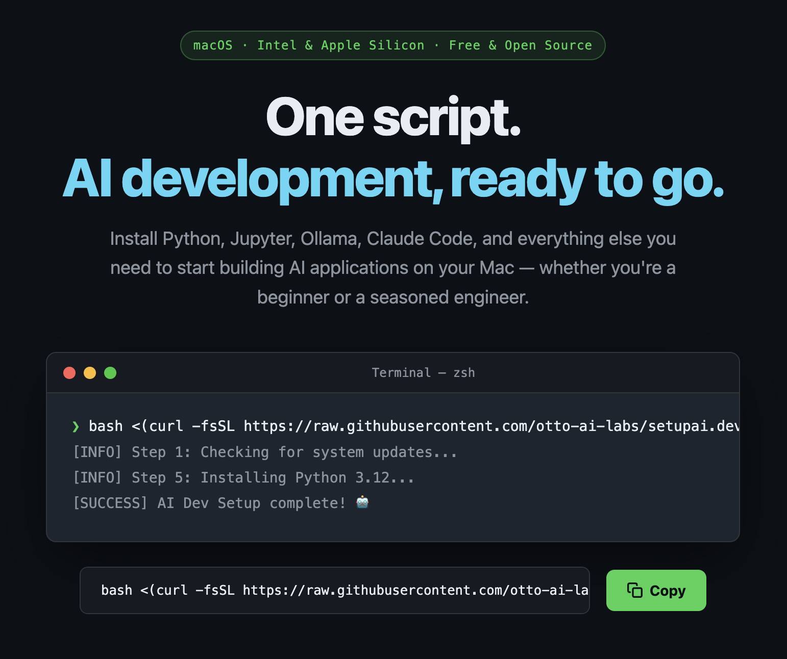

# TheVibeFounder Build Day Stack

> **One command. Ship by end of day.**

[](https://www.apple.com/macos/)
[](https://www.microsoft.com/windows/)
[](https://opensource.org/licenses/MIT)
[](https://www.gnu.org/software/bash/)



The fastest way to go from a fresh Mac **or Windows PC** to shipping AI-powered products. No bloat, no noise — just the tools you actually reach for on a build day.

**macOS:** Works on both **Intel** and **Apple Silicon** Macs (M1, M2, M3, M4 and later).
**Windows:** Works on **Windows 10 (1809+)** and **Windows 11**.

---

## Quick Start

### macOS

```bash
bash <(curl -fsSL https://raw.githubusercontent.com/otto-ai-labs/setupai.dev/main/setup.sh) --light
```

### Windows

Open **PowerShell** as Administrator:

```powershell
& ([scriptblock]::Create((irm https://raw.githubusercontent.com/otto-ai-labs/setupai.dev/main/windows/setup.ps1)))
```

Or with the `-Light` flag for the same lean defaults:

```powershell
# Clone first (recommended so you can review before running)
git clone https://github.com/otto-ai-labs/setupai.dev.git
cd setupai.dev\windows
.\setup.ps1 -Light
```

On Windows the script uses **Winget + Scoop** instead of Homebrew, **Oh My Posh** instead of Oh My Zsh, **nvm-windows** for Node, and **PowerToys** instead of Raycast/Rectangle/AltTab. Everything else is the same.

---

## Before You Start

**macOS — Update your OS** — System Settings → General → Software Update.

**Windows — Check PowerShell version** — Run `$PSVersionTable.PSVersion`. You need 5.1+; 7+ is recommended ([download](https://github.com/PowerShell/PowerShell/releases)).

**2. Have your Git name and email ready** — same as your GitHub account.

**3. Grab your API keys:**
- [console.anthropic.com](https://console.anthropic.com) → Anthropic key (Claude Code)
- [platform.openai.com](https://platform.openai.com) → OpenAI key (Codex CLI)

**4. Set aside ~20 minutes** — lighter than the full install, but still downloads a few GB.

---

### Prefer to review the scripts first?

```bash
# macOS
git clone https://github.com/otto-ai-labs/setupai.dev.git
cd setupai.dev
./setup.sh --light

# Windows (PowerShell as Admin)
git clone https://github.com/otto-ai-labs/setupai.dev.git
cd setupai.dev\windows
.\setup.ps1 -Light
```

### How it works

The script asks for your **Git name** and **Git email**, then shows checkbox menus for each category. Everything useful is already checked — press **D** (macOS) or the same key on Windows to confirm each menu and move on. Takes ~20 minutes.

---

## What You Get

### Always installed

| Tool | What it does |
|------|-------------|
| **Homebrew** | Package manager — installs everything else. |
| **Git + SSH key** | Version control, auto-configured and tied to your GitHub email. |
| **Oh My Zsh + Starship** | A fast, clean shell with git-aware prompt. |
| **zsh-autosuggestions** | Suggests commands as you type. |
| **zsh-syntax-highlighting** | Valid commands green, errors red — as you type. |
| **Python 3.12 + uv** | Python and the fastest package manager available. |
| **Node.js LTS** | Installed via nvm. Required for Claude Code and Codex CLI. |
| **bat, eza, fd, ripgrep, fzf** | Modern CLI replacements for cat, ls, find, grep. |
| **jq, yq, htop, tree, wget** | Essential terminal utilities. |

### Pre-selected in menus (on by default)

| Tool | What it does |
|------|-------------|
| **Claude Code** | Anthropic's AI coding CLI. Your main coding tool. |
| **Codex CLI** | OpenAI's coding CLI. |
| **GitHub CLI** | Manage repos, PRs, and issues from the terminal. |
| **Redis** | In-memory store for caching and queues. |
| **SQLite** | Lightweight embedded database for local apps. |
| **Cursor** | AI-native editor — built-in chat, autocomplete, multi-file edits. |
| **Warp** | AI-powered terminal with natural language commands. |
| **iTerm2** | Classic terminal — tabs, split panes, themes. |
| **Obsidian** | Local markdown notes and knowledge base. |
| **Lungo** | Keeps your Mac awake during long installs. |
| **Shottr** | Fast screenshot tool with annotations and OCR. |

### Skipped by default in `--light`

These are off in the menus but you can toggle them back on before confirming:

| Skipped | Why |
|---------|-----|
| Ollama | Large download, GPU-heavy — use Claude/Codex APIs instead |
| Jupyter | Heavyweight, separate Python kernel — not needed for most builds |
| Python 3.11 | 3.12 covers everything |
| PostgreSQL | Overkill for build days — SQLite or Redis handles most cases |
| DuckDB | Analytical DB — niche use case |
| VS Code | Cursor replaces it |
| Raycast | Great app, not essential day one |
| Rectangle / AltTab | Window manager extras — add later if you want |
| LM Studio | GUI for local models — not needed with API access |
| DBeaver / TablePlus | DB GUIs — skip if you're comfortable in the terminal |

---

## After the Script Finishes

**1. Open a new terminal window** (or run `source ~/.zshrc`).

**2. Add your SSH key to GitHub:**
```bash
cat ~/.ssh/id_ed25519.pub
```
Paste it at [github.com/settings/keys](https://github.com/settings/keys).

**3. Set your API keys** — add to `~/.extra` (gitignored, auto-loaded by your shell):
```bash
export ANTHROPIC_API_KEY='sk-ant-...'
export OPENAI_API_KEY='sk-...'
```

**4. Start building:**
```bash
claude       # Claude Code
cursor .     # Open current folder in Cursor
```

**5. Restart your Mac** to apply all system changes.

---

## Troubleshooting

### macOS

**`claude` not found:**
```bash
source ~/.zshrc
npm install -g @anthropic-ai/claude-code
```

**`node` / `npm` not found:**
```bash
source ~/.zshrc
nvm install --lts && nvm use --lts
```

**`nvm` not found:**
```bash
export NVM_DIR="$HOME/.nvm"
[ -s "$NVM_DIR/nvm.sh" ] && \. "$NVM_DIR/nvm.sh"
```

**A package failed:** Check `~/ai-dev-setup_DATE_TIME.log`, then install manually:
```bash
brew install <package>
npm install -g <package>
```

### Windows

**`claude` not found:**
```powershell
. $PROFILE
npm install -g @anthropic-ai/claude-code
```

**`node` / `npm` not found:**
```powershell
. $PROFILE
nvm install lts
nvm use lts
```

**`winget` not found:** Install "App Installer" from the Microsoft Store, then re-run.

**A package failed:** Check `$env:USERPROFILE\ai-dev-setup_DATE_TIME.log`, then install manually:
```powershell
winget install <WingetId>
npm install -g <package>
```

---

## License

[MIT](LICENSE) — free to use, modify, and share.

---

*Built for founders who ship.*
